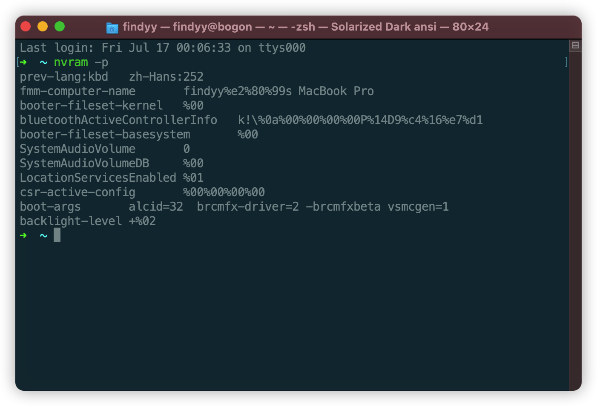

# English(current) 
### This is the configuration of the computer

-**Intel 5th Generation Architecture (Broadwell)**
-**Intel HD Graphics 5500**
-**Intel Series 9 Chipset Family**
-**macOS Big Sur**
-**Broadcom DW1560**

### Recommended **BIOS** settings
-`Security -> Security Chip`: **Disabled**;
-`Virtualization -> Intel Virtualization Technology`: **Enabled**;
-`Internal Device Access -> Bottom Cover Tamper Detection`:**Disabled**;
-`Anti-Theft -> Current Setting`: **Disabled**;
-`Anti-Theft -> Computrace -> Current Setting`: **Disabled**;
-`Secure Boot -> Secure Boot`: **Disabled**;
-`UEFI/Legacy Boot: UEFI Only;
CSM Support`: **Yes**.

## ⚠️ New installation and OTA attention! !

- Requires `FakeSMC`, can be replaced with `VirtualSMC` after installation, which an be changed in `config, plist`.
- The `booter-fileset-basesystem` and `booter-fileset-kernel` parameters of `7C436110-AB2A-4BBB-A880-FE41995C9F82` in `Nvram` should be removed.
- `csr-active-config` in `Nvram` should be set to `00000000<data>`.
- For the above operation of `Nvram`, you can enter `nvarm -p` in the terminal to check whether the change of `nvram` is successful. Just like 

###  works well

- CPU: Good frequency conversion.
- Graphics card: HD5500, good drive, acceleration available, mini DP external display, HDMI display with Dock.
- Sound card: use layout-id 32, if not suitable, you can replace it by yourself.
- Touchpad: powered by `VoodooSMBus` and `VoodooRMI`, silky and smooth, can be temporarily disabled by `PrtSc`.
- USB: works good.
- Little red dot: works good.

### Places not working
- VGA

### Another things for dock-users
- HDMI: works fine.
- USB: works fine.
- Audio: works only when `layout-id` is 55.