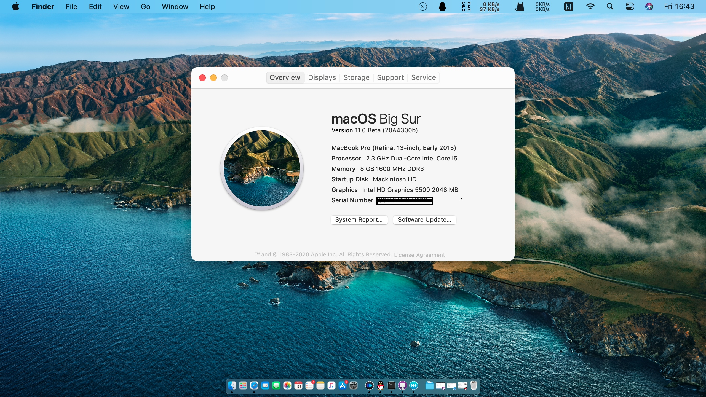

### 这是电脑的配置

- **Intel 5th Generation Architecture (Broadwell)**
- **Intel HD Graphics 5500**
- **Intel Series 9 Chipset Family**
- **macOS Big Sur**
- **Broadcom DW1560** 

### 推荐的**BIOS**设置
- `Security -> Security Chip`: **Disabled**;
- `Virtualization -> Intel Virtualization Technology`: **Enabled**;
- `Internal Device Access -> Bottom Cover Tamper Detection`:**Disabled**;
- `Anti-Theft -> Current Setting`: **Disabled**;
- `Anti-Theft -> Computrace -> Current Setting`: **Disabled**;
- `Secure Boot -> Secure Boot`: **Disabled**;
- `UEFI/Legacy Boot: UEFI Only;
CSM Support`: **Yes**.

### 工作良好的地方

- CPU：变频良好。
- 显卡：HD5500，驱动良好，加速可用，可mini DP 外接显示器，有Dock的接HDMI显示器。
- 声卡：由于目前想启用DOCK的耳机接口，故采用layout-id 55，若不合适，可自行更换。
- 触摸板：驱动良好，最多可三指。
- USB：驱动良好。

### 不工作的地方
- SMC传感器未适配，导致CPU频率与电池信息无。