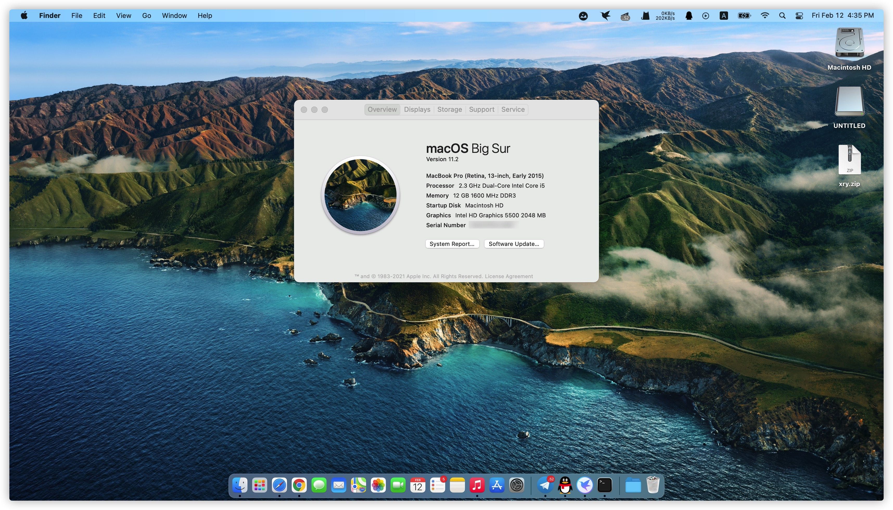

# 将分支切换为从T460S移植的仓库，谢谢
# 中文(当前)
# [English](README-E.md)
# OpenCore版本：0.6.9

### 新特性
- 增加了对YogaSMC功能的部分支持。

### 这是电脑的配置

- **Intel 5th Generation Architecture (Broadwell)**
- **Intel HD Graphics 5500**
- **Intel Series 9 Chipset Family**
- **macOS Big Sur**
- **Broadcom DW1560** 

### 推荐的**BIOS**设置
- `Security -> Security Chip`: **Disabled**;
- `Virtualization -> Intel Virtualization Technology`: **Enabled**;
- `Internal Device Access -> Bottom Cover Tamper Detection`:**Disabled**;
- `Anti-Theft -> Current Setting`: **Disabled**;
- `Anti-Theft -> Computrace -> Current Setting`: **Disabled**;
- `Secure Boot -> Secure Boot`: **Disabled**;
- `UEFI/Legacy Boot`: **UEFI Only**;
- `CSM Support`: **Yes**.

### 工作良好的地方

- CPU：变频良好。
- 显卡：HD5500，驱动良好，加速可用，可mini DP 外接显示器。
- 声卡：采用layout-id 32，若不合适，可自行更换。
- 触摸板：采用`VoodooSMBus`和`VoodooRMI`驱动，丝滑流畅。
- USB：驱动良好。
- 小红点和三键：驱动良好。
- 402A扩展坞USB接口、VGA、DP接口工作良好。

### 不工作的地方
- VGA
